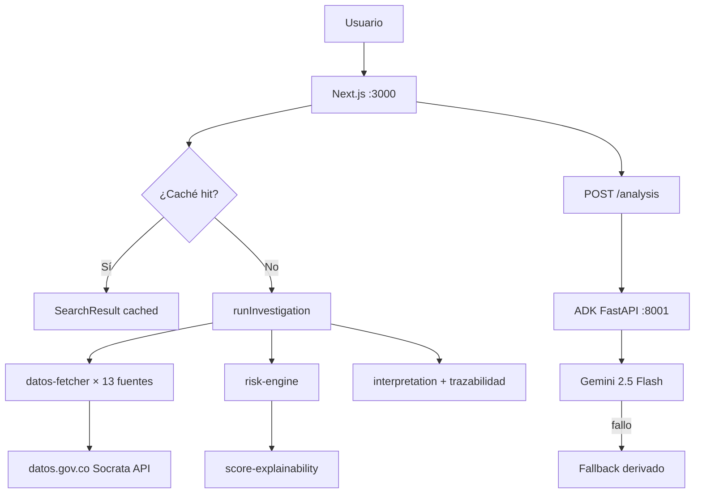

# FASE 22 — Informe de Completitud

**Proyecto:** NeurAudit AI  
**Fecha:** 3 de junio de 2026  
**Estado:** COMPLETADA — pendiente aprobación  
**Alcance:** Solo backend y arquitectura. Sin cambios de UI, diseño, colores, tipografía ni glassmorphism.

---

## Resumen ejecutivo

Fase 22 implementa la capa de datos robusta (paginación real, estados por fuente, trazabilidad), unifica todos los flujos IA bajo ADK → Gemini → Fallback, añade caché de investigaciones, explicabilidad formal del score, orquestación Docker y documentación de arquitectura real.

**Build:** `npm run build` — SUCCESS (13 rutas estáticas + APIs dinámicas).

---

## Tareas completadas

| # | Tarea | Estado |
|---|-------|--------|
| 1 | Paginación real para todas las fuentes SECOP/datos.gov.co | ✅ |
| 2 | Sistema de estado por fuente (`success`, `timeout`, `error`, `empty`) | ✅ |
| 3 | Trazabilidad completa de fuentes utilizadas | ✅ |
| 4 | Unificar flujos IA: ADK → Gemini → Fallback | ✅ |
| 5 | Caché de investigaciones | ✅ |
| 6 | docker-compose funcional (Next.js + ADK FastAPI + env) | ✅ |
| 7 | README con arquitectura real | ✅ |
| 8 | Explicabilidad completa del score de riesgo | ✅ |
| 9 | Este documento | ✅ |

**Excluido (según instrucciones):** Fase 23, autenticación, PostgreSQL, Stripe, Elastic, cambios visuales.

---

## Archivos modificados

### Nuevos

| Archivo | Propósito |
|---------|-----------|
| `src/lib/datos-fetcher.ts` | Cliente Socrata con paginación `$limit`/`$offset` y estados por fuente |
| `src/lib/investigation-cache.ts` | Caché en memoria con TTL configurable |
| `src/lib/score-explainability.ts` | Explicabilidad formal de las 10 reglas del motor de riesgo |
| `docker-compose.yml` | Orquestación Next.js + ADK Analyze |
| `Dockerfile` | Imagen producción Next.js (standalone) |
| `neuraudit_agent/Dockerfile` | Imagen FastAPI ADK Analyze |
| `neuraudit_agent/requirements.txt` | Dependencias Python del servicio ADK |
| `.env.example` | Plantilla de variables de entorno |
| `docs/PHASE22_COMPLETION_REPORT.md` | Este informe |

### Modificados

| Archivo | Cambio |
|---------|--------|
| `src/lib/investigation.ts` | Reescrito: 13 fuentes con paginación, `fuentesTrace`, `scoreExplainability`, `meta` |
| `src/lib/types.ts` | Tipos `SourceStatus`, `SourceTraceEntry`, `ScoreExplainability`, `InvestigationMeta` |
| `src/lib/interpretation.ts` | Trazabilidad enriquecida con estado por fuente |
| `src/app/api/agent/search/route.ts` | Caché + IA unificada (`generateAnalysis`) en `?insights=true` |
| `src/app/api/agent/compare/route.ts` | Migrado de `insights.ts` a `generateComparativeAnalysis` + caché |
| `src/app/api/system/status/route.ts` | Métricas de caché |
| `neuraudit_agent/analyze_service.py` | CORS Docker (`nextjs:3000`) |
| `next.config.ts` | `output: "standalone"` para Docker |
| `README.md` | Arquitectura real documentada |

### Sin modificar (UI)

- `src/app/page.tsx`, componentes visuales, `globals.css`, sidebar, paneles IA, PDF layout.

---

## Arquitectura antes / después

### Antes (Fase 21)

```
GET /api/agent/search
  └─ investigation.ts
       └─ fetch único ($limit=20-50) por fuente
       └─ errores → return [] (silenciados)
       └─ sin estados por fuente
       └─ sin caché
       └─ sin explicabilidad formal

GET /api/agent/compare
  └─ generateInsights() (flujo legado, distinto al panel IA)

POST /api/agent/analysis
  └─ ADK → Gemini → Fallback ✅ (ya unificado)

ADK :8001 → arranque manual
README → claims Elastic/grafos desactualizados
```

### Después (Fase 22)

```
GET /api/agent/search?q=&nocache=
  ├─ investigation-cache (TTL 30 min, configurable)
  └─ runInvestigation()
       ├─ datos-fetcher.ts → paginación real (500/página, máx 10.000/fuente)
       ├─ fuentesTrace[] → success | timeout | error | empty
       ├─ scoreExplainability → 10 reglas documentadas
       ├─ meta → duración, contadores por estado
       └─ interpretacion.trazabilidad → detalle por fuente

GET /api/agent/compare
  └─ generateComparativeAnalysis() → ADK → Gemini → Fallback (unificado)

POST /api/agent/analysis / GET ?insights=true
  └─ generateAnalysis() → ADK → Gemini → Fallback (unificado)

docker compose up → Next.js :3000 + ADK :8001 + healthcheck
```

### Diagrama



---

## Métricas mejoradas

| Métrica | Antes | Después |
|---------|-------|---------|
| Registros máx. por fuente | 20–50 | 10.000 (paginación 500/página) |
| Fuentes con estado explícito | 0 | 13 (success/timeout/error/empty) |
| Trazabilidad en payload API | Parcial (conteos) | Completa (`fuentesTrace` + narrativa) |
| Flujos IA unificados | 1 de 3 (solo `/analysis`) | 3 de 3 (search+insights, compare, analysis) |
| Caché de investigaciones | No | Sí (memoria, TTL configurable) |
| Explicabilidad del score | Solo `scoreBreakdown` | `scoreExplainability` con reglas aplicadas/no aplicadas |
| Despliegue reproducible | Manual (2 terminales) | `docker compose up --build` |
| Diagnóstico sistema | Gemini + ADK | + métricas de caché |

---

## Riesgos detectados

| Riesgo | Severidad | Mitigación actual | Próximo paso sugerido |
|--------|-----------|-------------------|----------------------|
| Timeout en consultas pesadas (13 fuentes × paginación) | Media | Timeout 20s/fuente; `Promise.all` paralelo | Rate limiting + cola async (Fase 23+) |
| Caché en memoria se pierde al reiniciar | Baja | TTL 30 min; `?nocache=true` | Redis/PostgreSQL si escala multi-instancia |
| Procuraduría busca por tema/subtema, no entidad | Media | Misma lógica que antes; documentado | Mejorar query por NIT/razón social |
| datos.gov.co rate limits | Media | Cap 10.000 registros/fuente | Backoff exponencial entre páginas |
| ADK Analyze depende de `GOOGLE_API_KEY` | Alta | Fallback derivado siempre disponible | Alertas en `/api/system/status` |
| Docker sin volúmenes persistentes | Baja | Stateless por diseño | Volúmenes si se añade caché persistente |

---

## Próximos pasos (Fase 23+, no iniciados)

1. **Persistencia:** PostgreSQL para historial server-side y caché distribuido.
2. **Autenticación:** Sesiones y roles de auditor.
3. **Elastic:** Indexación SECOP para búsqueda semántica (script existente `scripts/index-secop.mjs`).
4. **Async jobs:** Cola para investigaciones largas con progreso SSE.
5. **Mejora queries Procuraduría:** Búsqueda por identificación de entidad.
6. **Stripe / SaaS:** Facturación y planes (fuera de alcance Fase 22).

---

## Verificación

```bash
# Build
npm run build          # ✅ SUCCESS

# Desarrollo
uvicorn neuraudit_agent.analyze_service:app --port 8001
npm run dev

# Docker
cp .env.example .env   # configurar GOOGLE_API_KEY
docker compose up --build

# Endpoints de prueba
curl "http://localhost:3000/api/agent/search?q=alcaldia"
curl "http://localhost:3000/api/agent/search?q=alcaldia&nocache=true"
curl "http://localhost:3000/api/system/status"
```

---

## Aprobación

Fase 22 completada. **No se inició Fase 23.**

Esperando aprobación del equipo para continuar.
